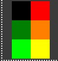

# raytracer

-> we will be shooting rays out from the camera into a scene, and those rays will hit smothing bouce around and hit someother object
and we will take some color from each of those collisions and determine what color should show up at a given axis

-> this is kind of path tracing because we are following around the path of rays 

-> we will be using the ppm image format, it is a strange image format 

